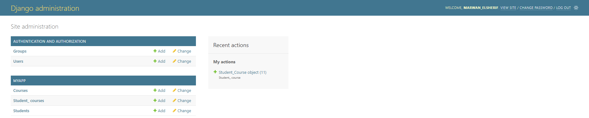

# Engineering Academy App

## Introduction

This project consists of a simle Django backend and a React frontend.

## Prerequisites

Make sure you have the following installed on your system:

### Installing Node.js

1. **Download the Node.js installer:**
   Go to the [Node.js download page](https://nodejs.org/en/download/) and download the Windows installer.

2. **Run the installer:**
   Follow the prompts in the Node.js Setup Wizard. Make sure to install the recommended version.

3. **Verify the installation:**
   Open Command Prompt and run:
   ```bash
   node -v
   npm -v
   ```
---
### Downloading Python

1. **Visit the official Python website:**
   Go to the [Python downloads page](https://www.python.org/downloads/).

2. **Download the installer:**
   Click on the "Download Python" button. This will download the latest version of Python.

### Installing Python

1. **Run the installer:**
   Locate the downloaded Python installer (it will be a `.exe` file) and double-click it to run the installer.

2. **Customize the installation:**
   - **Add Python to PATH:**
     Make sure to check the box that says "Add Python 3.x to PATH". This will make it easier to run Python from the command line.
   - **Customize installation:**
     If you want to customize the installation, click on "Customize installation". Otherwise, you can click "Install Now".

3. **Follow the installation steps:**
   The installer will guide you through the installation process. Click "Next" to proceed through each step and finally click "Install".

4. **Finish the installation:**
   Once the installation is complete, click "Close" to exit the installer.

### Verifying the Installation

1. **Open Command Prompt:**
   Press `Win + R`, type `cmd`, and press Enter to open the Command Prompt.

2. **Check the Python version:**
   Type the following command and press Enter:
   ```bash
   python --version
   ```
#### Install Django
```
   pip install django
   ```
---

### To clone the Back-End repo
```bash
    git clone https://github.com/IbrahimHanyEl-Sheikh/simple-django-app.git
```

### To clone the Front-End repo
```bash
    git clone https://github.com/IbrahimHanyEl-Sheikh/simple-react-app.git
```

## Backend Setup (Django)

1. **Navigate to the backend directory:**
    ```bash
    cd simple-django-app
    ```

2. **Run migrations:**
    ```bash
    python manage.py migrate
    ```

3. **Run the development server:**
    ```bash
    python manage.py runserver
    ```

    The Django app should now be running at `http://127.0.0.1:8000/`.

## Frontend Setup (React)

1. **Navigate to the frontend directory:**
    ```bash
    cd simple-react-app
    ```

2. **Install dependencies:**
    ```bash
    npm install
    ```

3. **Start the development server:**
    ```bash
    npm start
    ```

    The React app should now be running at `http://localhost:3000/`.


## Tasks

### Task One
In the front end repo create an admin page following the structure of the Django admin page as shown in the screenshot



The admin should be able to view all courses and all students and perform different operations on them.

### Task Two
Create a new API Endpoint in the backend to set the courses